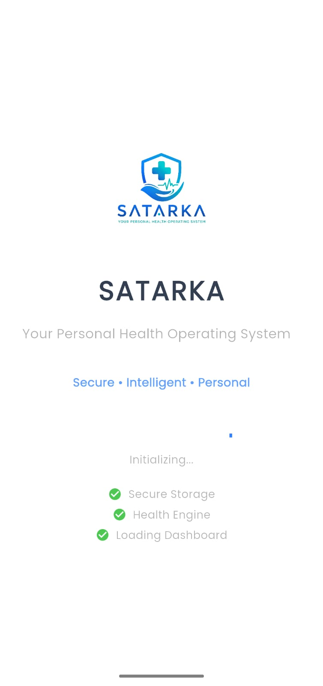
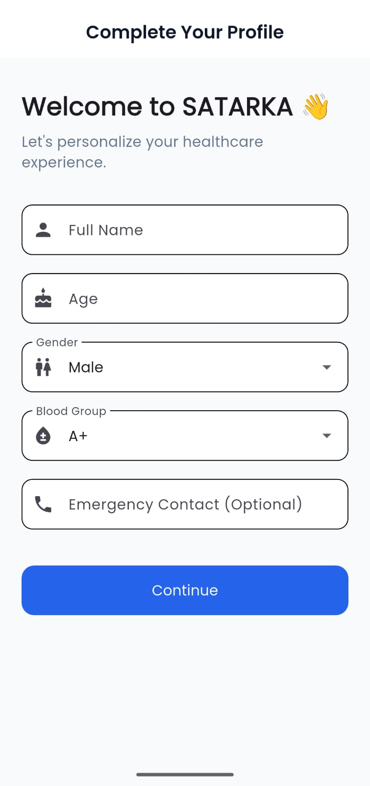
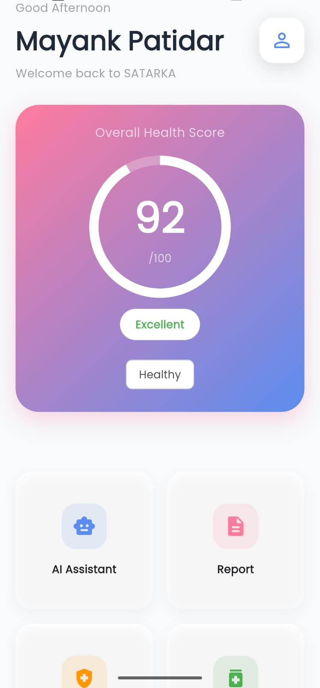
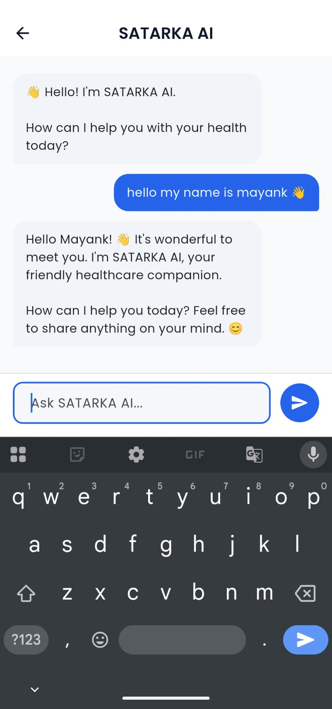
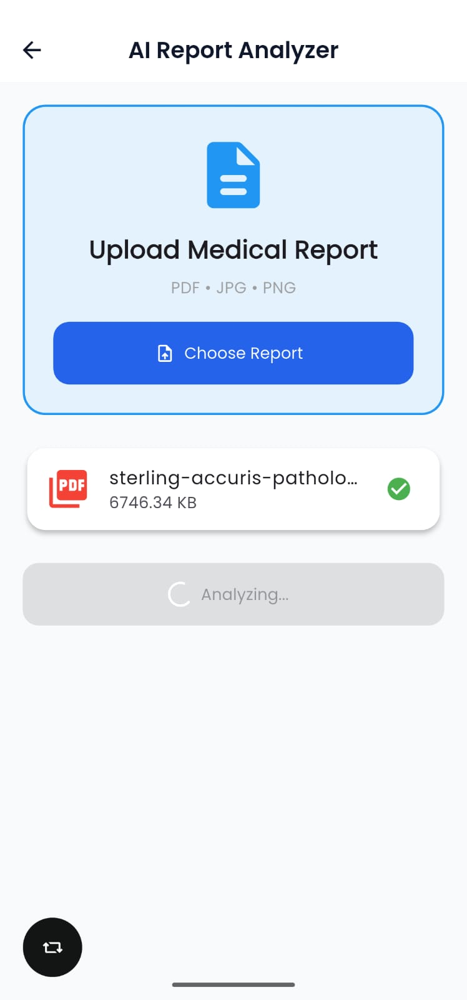
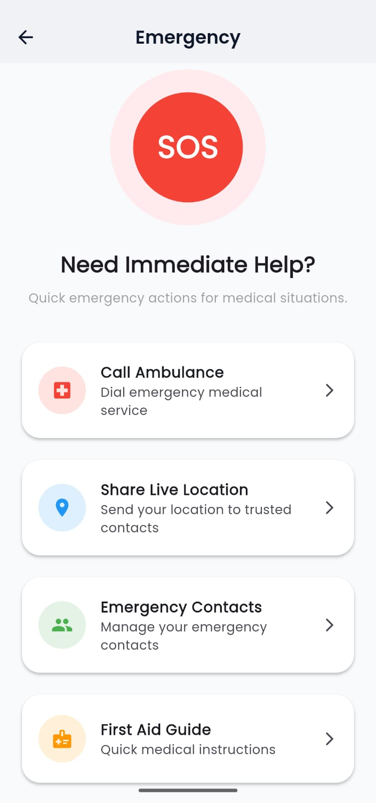
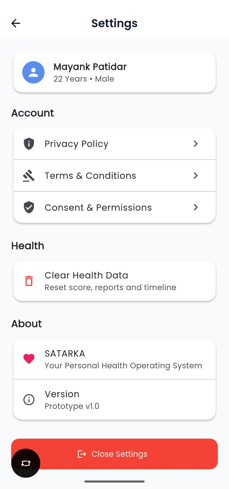

# 🏥 SATARKA

### Your Personal Health Operating System

<p align="center">
  
</p>

<p align="center">
AI-Powered Healthcare Platform built using Flutter, FastAPI and Google Gemini AI.
</p>

<p align="center">
  
  
  
  
  
</p>

## 🔗 Quick Access

📱 APK Download:
https://drive.google.com/drive/folders/1SliQ2q-NsiFzaTUa8lgQEmeWxJZTnBLt

🌐 Backend API:
https://satarka-backend.onrender.com

📂 Frontend Repository:
https://github.com/mayankptdr/Satarka-app

⚙️ Backend Repository:
https://github.com/mayankptdr/Satarka-backend

🎥 Demo Video:
Coming Soon


# 🚀 About SATARKA

SATARKA is an AI-powered healthcare platform designed to connect every healthcare interaction into one continuous health journey.

Instead of acting as just another healthcare application, SATARKA functions as a **Personal Health Operating System**, helping users manage their health records, AI assistance, medical reports, health scores, emergency support, medications, and future healthcare services from a single intelligent platform.

---

# 🎯 Vision

Our vision is to build the digital operating system for healthcare by connecting:

- Patients
- Doctors
- Hospitals
- Diagnostic Laboratories
- Pharmacies
- Insurance Providers
- Emergency Services
- Wearable Devices

into one intelligent healthcare ecosystem.

---

# ✨ Core Features

## 🤖 AI Health Assistant

- AI-powered healthcare conversations
- Personalized health guidance
- Symptom-based recommendations
- Powered by Google Gemini AI

---

## 📄 Medical Report Analyzer

- Upload medical reports
- AI-generated report summaries
- Identify abnormal values
- Health insights and explanations

---

## 📊 Health Score Engine

- Dynamic health scoring
- Health risk indicators
- Wellness tracking
- Progress monitoring

---

## 💊 Medicine Management

- Medication reminders
- Treatment tracking
- Medicine history

---

## 🩺 Symptom Checker

- Symptom assessment
- Health recommendations
- Early healthcare guidance

---

## 📅 Health Timeline

- Continuous health journey
- Health event tracking
- Medical history visualization

---

## 🚨 Emergency Module

- SOS support
- Ambulance quick access
- Emergency contacts
- First-aid guidance
- Location sharing

---

## 🔒 Privacy & Consent

- User-controlled health data
- Consent management
- Privacy-first architecture
- DPDP-inspired design approach

---

# 🏗️ System Architecture

```text
Foundation Layer
       ↓
AI Intelligence Layer
       ↓
Core Health Modules
       ↓
Healthcare Integration Layer
       ↓
Continuous Health Journey
```

---

# 🛠️ Technology Stack

## Frontend

- Flutter
- Dart

## Backend

- FastAPI
- Python

## AI Layer

- Google Gemini AI

## APIs

- REST APIs

## Deployment

- Render

---

# 📱 Application Screenshots

<table>
<tr>
<td align="center">
<b>Splash Screen</b><br><br>

</td>

<td align="center">
<b>Authentication</b><br><br>

</td>
</tr>

<tr>
<td align="center">
<b>Profile Setup</b><br><br>

</td>

<td align="center">
<b>Dashboard</b><br><br>

</td>
</tr>

<tr>
<td align="center">
<b>AI Assistant</b><br><br>

</td>

<td align="center">
<b>Medical Report Analyzer</b><br><br>

</td>
</tr>

<tr>
<td align="center">
<b>Emergency Module</b><br><br>

</td>

<td align="center">
<b>Settings</b><br><br>

</td>
</tr>
</table>

---

# 🌐 Live Services

## Backend API

https://satarka-backend.onrender.com

---

# 📂 Source Code

## Frontend Repository

https://github.com/mayankptdr/Satarka-app

## Backend Repository

https://github.com/mayankptdr/Satarka-backend

---

# 🔮 Future Roadmap

### 👨‍👩‍👧 Family Health Management

- Family member profiles
- Shared healthcare records
- Dependent management

### 👨‍⚕️ Doctor Appointment Booking

- Find doctors
- Schedule appointments
- Appointment reminders

### 🧪 Diagnostic Lab Integration

- Lab test booking
- Report delivery
- Automated report synchronization

### 💊 Online Medicine Ordering

- Medicine search
- Pharmacy integration
- Home delivery support

### 🏥 Hospital Integration

- Hospital discovery
- Health record sharing
- Treatment continuity

### 📱 Wearable Device Integration

- Smartwatch integration
- Activity tracking
- Continuous monitoring

### 🪪 ABHA Integration

- National healthcare identity support
- Digital health records

### 📈 Predictive Health Intelligence

- Health risk prediction
- Personalized preventive recommendations
- Long-term health insights

---

# 🔐 Privacy

Healthcare data is highly sensitive.

SATARKA follows a privacy-first approach where users remain in control of their health information through transparent consent management and responsible data handling aligned with the principles of India's Digital Personal Data Protection (DPDP) Act.

---

# 👨‍💻 Developer

**Mayank Patidar**

B.Tech Artificial Intelligence & Data Science

Lakshmi Narain College of Technology (LNCT), Bhopal

---

# ⭐ Support

If you found this project interesting, consider giving it a star on GitHub.

---

## "Connecting Every Healthcare Interaction Into One Continuous Health Journey."
